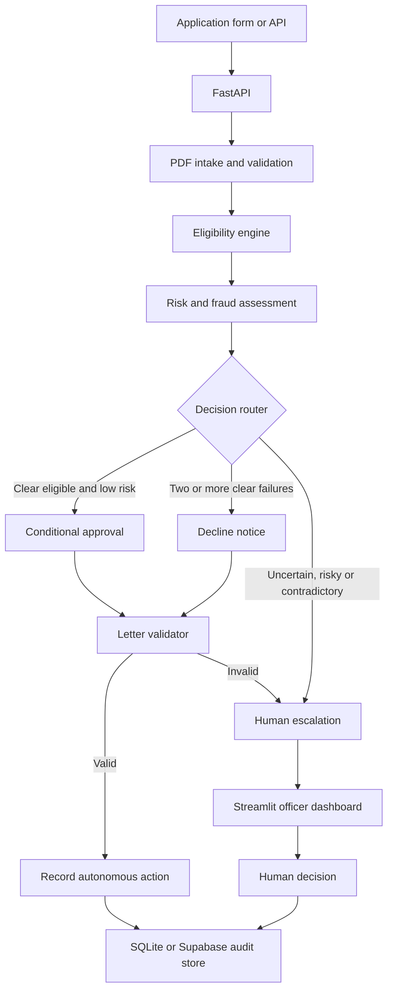

# FlowMind System Architecture

## Overview

FlowMind is a human-in-the-loop loan-processing prototype for ClearPath
Capital. It separates document intake, business rules, qualitative risk,
decision routing, generated communication and human review into testable
components.

## Logical Flow

