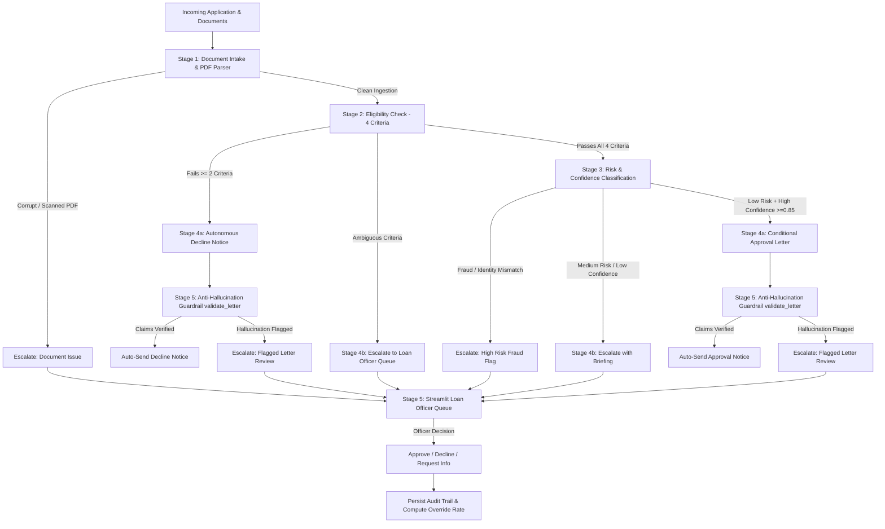

# Deliverable D1: ClearPath Capital Decision Logic Specification

**Client:** ClearPath Capital (Lagos, Nigeria)  
**System:** FlowMind Intelligent Workflow Automation  
**Version:** 1.0.0

---

## 1. Complete Decision Tree Architecture

Every application entering FlowMind moves through deterministic and probabilistic decision branches:

---

## 2. Published Eligibility Criteria Rules

| # | Criterion | Verification Rule | Threshold Bounds | Confidence Determinant |
| :--- | :--- | :--- | :--- | :--- |
| **1** | **Business Registration** | Operating duration since formal incorporation or verified start. | `>= 12 months` | **High** if CAC RC/BN number provided; **Medium** if unverified. |
| **2** | **Applicant Age** | Valid age on national ID / form submission. | `21 <= Age <= 65 years` | **High** if standard integer provided. |
| **3** | **Turnover Ratio** | Ratio of requested loan amount to average monthly turnover. | `Loan / Turnover <= 10.0x` | **High** if corroborated by bank statements. |
| **4** | **Loan Purpose** | Stated business utilization falls in productive SME categories. | Approved: *Inventory, Equipment, Working Capital, Agriculture*. Prohibited: *Crypto, Gambling, Speculation*. | **High** for clear category match; **Medium** for ambiguous wording. |

---

## 3. Confidence Threshold Calibration Policy

- **High Confidence Threshold (`>= 0.85`)**: Requires 3/3 self-consistency agreement and specific applicant fact citations.
- **Medium Confidence Threshold (`0.65 - 0.84`)**: Minor ambiguity or 2/3 model agreement -> triggers automatic escalation.
- **Asymmetry of Error**:
  - **Type I Error (False Approval)**: High cost (financial loss / default). Protected by strict Low Risk requirement and letter guardrails.
  - **Type II Error (False Decline)**: High customer churn. Protected by requiring at least 2 clear failures for auto-decline; single-failure borderline cases escalate to human loan officers.
