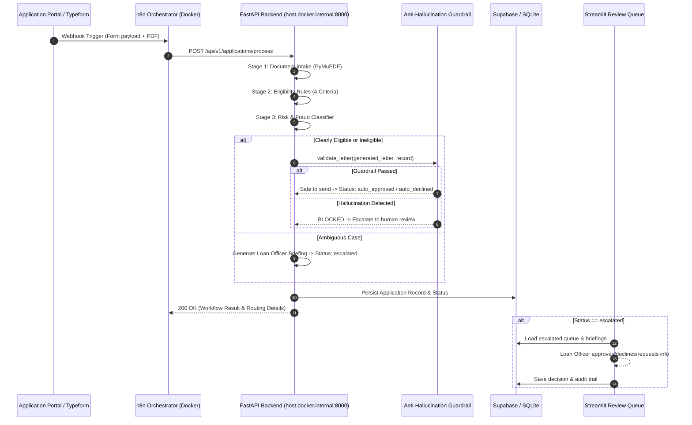

# FlowMind Integration & Orchestration Guide

**Target Audience:** n8n Workflow Engineers, Backend Developers, and DevOps  
**Client:** ClearPath Capital (Lagos, Nigeria)

---

## 1. End-to-End Orchestration Architecture



---

## 2. Docker & Network Configuration for n8n

When hosting n8n in Docker while FastAPI runs locally on host:

### Issue:
`localhost:8000` inside an n8n Docker container attempts to connect to the container's own loopback interface, resulting in `ECONNREFUSED`.

### Solution:
In n8n **HTTP Request** node:
- **URL:** `http://host.docker.internal:8000/api/v1/applications/process`
- **Method:** `POST`
- **Send Body:** JSON (Expression: `{{ $json }}`)
- **Header:** `Content-Type: application/json`

---

## 3. Running Backend Services

### 1. Start FastAPI Webhook Server:
```bash
python -m uvicorn api.main:app --host 0.0.0.0 --port 8000 --reload
```
Interactive OpenAPI Docs: `http://localhost:8000/docs`

### 2. Start Streamlit Review Dashboard:
```bash
python -m streamlit run dashboard/app.py --server.port 8501
```
Dashboard UI: `http://localhost:8501`

### 3. Run Automated Integration Suite:
```bash
python -m pytest tests/test_full_integration.py -v
```
